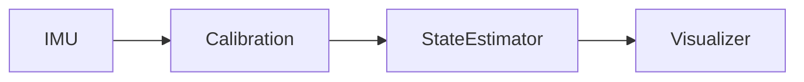

# Attitude Heading Reference System

[Attitude Heading Reference System (AHRS)](https://www.faa.gov/documentLibrary/media/Advisory_Circular/AC_20-181.pdf) is an integrated system that provides a vehicle (e.g. an aircraft) position and orientation in 3D space for navigation purpose. It is typically implemented by fusing data from various sensors such as accelerometers, gyroscopes, magnetometer (commonly referred to as *Inertia Measurement Units* or *IMU*). There are other applications such as self stabilizing platforms, self balancing robots, ...

In this project I am implementing the wellknown algorithms in this topic and applications to visualize the orientation.

## Hardware

These days, some IMUs such as BNO055 and the popular [MPU6050](https://mjwhite8119.github.io/Robots/mpu6050) implement many algorithms in the hardware. Using them are of course preferable for demanding applications.

We want to use more basic IMUs which only supply raw accelerations, angular velocities, etc. and then process them in software running on the computer so if desire, one should be able to port them to run on the microcontroller.

The IMU combinations should not matter (ADXL335, MPU6050, MPU9250, BNO160, LSM6D3S, ...) as long as they can generate 9 numbers

 * accelerations in 3 directions $$X, Y, Z$$ in unit of $$g$$ (the gravitational acceleration, roughly $$1g = 9.8 m/s^2$$),
 * rotational velocities in 3 axes in unit of radians per second,
 * magnetic field strength in 3 axes in unit of Gauss.

I am using the combination of a LSM6DS3 for accelerometer + gyroscope and a QMC5883 for magnetometer. Note that it is important to match the axes of the IMUs. For MCU, my choice is an ESP8266 in case I want to transmit sensor data over WiFi in the future.

The firmware is super simple: Read the sensors and dump 10 numbers (the timestamp followed by 9 numbers) over the serial port. Since printing out floating points is hard, we will use raw sensor values (integers) and convert them in the software.

## Calibration

Most sensors generate erroneous data due to manufacturing imperfection so they need to be calibrated. The **process** and **algorithm** varyfrom sensor to sensor.

For gyroscope, it is fairly simple. Let the device sit still (where we expect the rotational velocities to be all zero) to measure $N$ samples. Then take the average and subtract future measurements by that average. (We are doing an optimization problem here: if $X_1, ..., X_N$ are $N$ real numbers then the optimal $X$ that minimize the sum of squares $$(X_1 - X)^2 + ... + (X_N - X)^2$$ is the average.)

Accelerometer and magnetometer are much more involved (see https://forum.arduino.cc/t/how-to-calibrate-an-accelerometer/961066 and https://toptechboy.com/calibrating-a-3-axis-magnetometer/ .)

## Quaternion

## Visualization

## References and Resources

 * Short introduction video https://www.youtube.com/watch?v=eqZgxR6eRjo

 * This course on 9-axis IMU https://www.youtube.com/watch?v=2AO_Gmh5K3Q&list=PLGs0VKk2DiYwEo-k0mjIkWXlkrJWAU4L9 and https://toptechboy.com/arduino-based-9-axis-inertial-measurement-unit-imu-based-on-bno055-sensor/

 * MATLAB course on sensor fusion https://www.youtube.com/watch?v=6qV3YjFppuc&list=PLn8PRpmsu08ryYoBpEKzoMOveSTyS-h4a and Kalman filter https://www.youtube.com/watch?v=mwn8xhgNpFY&list=PLn8PRpmsu08pzi6EMiYnR-076Mh-q3tWr